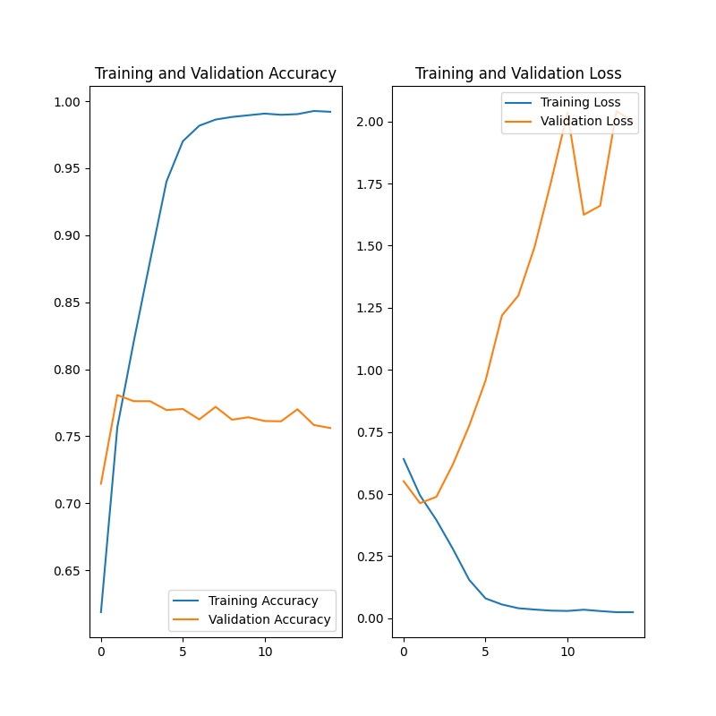
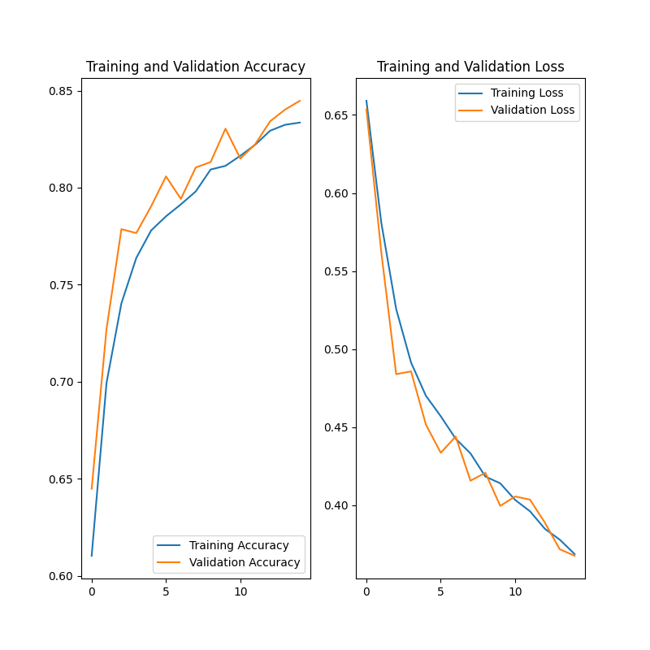
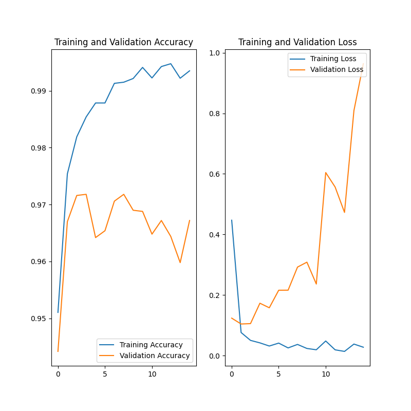
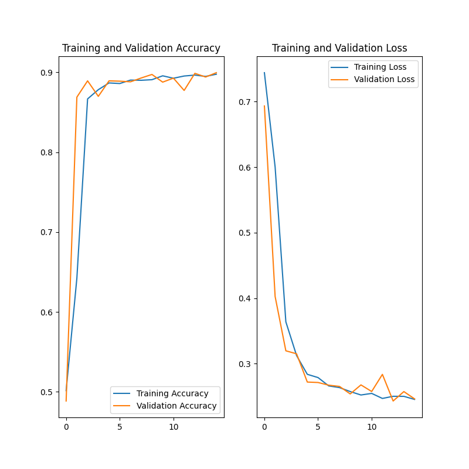

# Cats vs Dogs Classifier
  
In this repository, I created artificial intelligence to classify 224x224 photos of cats and dogs. All models were trained using TensorFlow 2.4.0 and 15 epochs.  
  
My current model produces an accuracy of ~90%.  
The dataset I used is from the [Kaggle Cats vs Dogs Redux: Kernel Edition](https://www.kaggle.com/c/dogs-vs-cats-redux-kernels-edition/) competition.  
It consists of 25000 training images, 1/2 of them cats & 1/2 of them dogs.

## Models + Plots  
  
plot-1.png shows some photos that were in the dataset.  
plot-2.png has been removed due to the data it in being incorrect from a bug in my code.  
  
plot-3.png is a chart showing the training accuracy vs validation accuracy as well as training loss vs validation loss. This data came from my original model.  
The way training accuracy increases exponentially whereas validation accuracy plateaus indicates that the model is overfitting. This is result it the model having a difficult time generalizing on a new dataset.
My original model consisted of these layers:
- Rescaling photos so all color values range from [0,1] instead of [0,255]. As well as, resizing them to 250x250.  
- Conv2D with 16 filters  
- MaxPooling2D with 2x2 pool size and 2 stride  
- Conv2D with 32 filters  
- MaxPooling2D with 2x2 pool size and 2 stride  
- Conv2D with 64 filters  
- MaxPooling2D with 2x2 pool size and 2 stride  
- Flatten  
- Dense 128 units  
- Dense 2 units (equal to the number of classes, ie [cats, dogs])  

### [Branch 1.0](https://github.com/justinleahy/cats-vs-dogs-classifier/tree/1.0)  
1.0 Model layers:  
- Preforming data augmentation. Random horizontal flip, random rotation, and random zoom. This will help with the overfitting present in the last model.  
- Rescaling photos so all color values range from [0,1] instead of [0,255]. As well as, resizing them to 250x250.  
- Conv2D with 16 filters  
- MaxPooling2D with 2x2 pool size and 2 stride  
- Conv2D with 32 filters  
- MaxPooling2D with 2x2 pool size and 2 stride  
- Conv2D with 64 filters  
- MaxPooling2D with 2x2 pool size and 2 stride  
- Dropout 20%  
- Flatten  
- Dense 128 units  
- Dense 2 units (equal to the number of classes, ie [cats, dogs])  

  
plot-4.png shows my current models training accuracy vs validation accuracy & training loss vs validation loss.  
  
### [Branch 1.1](https://github.com/justinleahy/cats-vs-dogs-classifier/tree/1.1)

All dataset images are run through data augmentation to randomly horizontally flip, rotate, and zoom. This helps with any overfitting on the training dataset.
The photos RGB values are normalized to make them range from [0,1] instead of [0,255].

1.1 Model layers:
- VGG16 Application
  (https://arxiv.org/abs/1409.1556)
- Dropout 20%
- Flatten
- Dense 128 Units
- Dense 2 Units

plot-5.png is where my model began for this branch. I was able to minimize the overfitting on training dataset down to what is shown in plot-9.png
Some other models I generated in this time are also shown in plot-7.png and plot-8.png.

## Computing Machine
CPU: AMD Ryzen 9 5900X  
GPU: NVIDIA RTX 3080  
RAM: 32GB 3600MHz  
OS: Ubuntu 2004