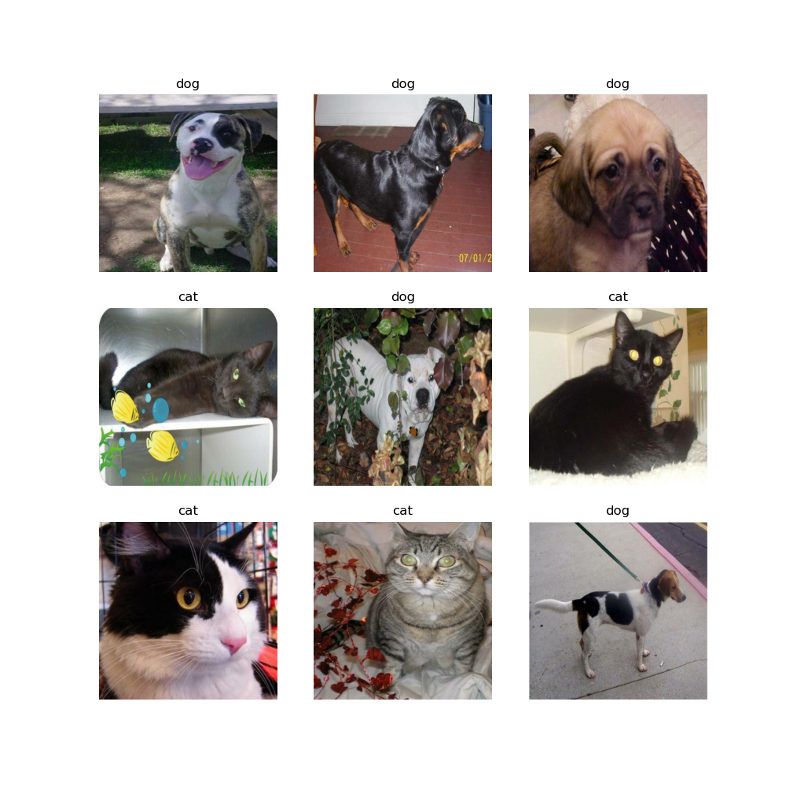

# Cats vs Dogs Classifier
  
In this repository, I created an artificial intelligence to classify 250x250 photos of cats and dogs. All models were trained using TensorFlow 2.4.0 and 15 epochs.  
  
My current model produces an accuracy of ~84%.  
  
The dataset I used is from the [Kaggle Cats vs Dogs Redux: Kernel Edition](https://www.kaggle.com/c/dogs-vs-cats-redux-kernels-edition/) competition.  
It consists of 25000 training images, 1/2 of them cats & 1/2 of them dogs.  

  
plot-1.png shows some of the photos that were in the dataset.  
  
plot-2.png has been removed due to the data it in being incorrect from a bug in my code.  
  
plot-3.png is a chart showing the training accuracy vs validation accuracy as well as training loss vs validation loss. This data came from my original model.
The way training accuarcy increases exponentially whereas validation accuracy plateaus indicates that the model is overfitting. This is result it the model having
a difficult time generalizing on a new dataset.  
  
My original model consisted of these layers:  
- Rescaling photos so all color values range from [0,1] instead of [0,255]. As well as, resizing them to 250x250.  
- Conv2D with 16 filters  
- MaxPooling2D with 2x2 pool size and 2 stride  
- Conv2D with 32 filters  
- MaxPooling2D with 2x2 pool size and 2 stride  
- Conv2D with 64 filters  
- MaxPooling2D with 2x2 pool size and 2 stride  
- Flatten  
- Dense 128 units  
- Dense 2 units (equal to the number of classes, ie [cats, dogs])  

plot-4.png shows my current models training accuracy vs validation accuracy & traing loss vs validation loss.  
[Branch 1.0](https://github.com/justinleahy/cats-vs-dogs-classifier/blob/1.0/generateModel.py)  
1.0 Model layers:  
- Preforming data augmentation. Random horizontal flip, random rotation, and random zoom. This will help with the overfitting present in the last model.  
- Rescaling photos so all color values range from [0,1] instead of [0,255]. As well as, resizing them to 250x250.  
- Conv2D with 16 filters  
- MaxPooling2D with 2x2 pool size and 2 stride  
- Conv2D with 32 filters  
- MaxPooling2D with 2x2 pool size and 2 stride  
- Conv2D with 64 filters  
- MaxPooling2D with 2x2 pool size and 2 stride  
- Dropout 20%  
- Flatten  
- Dense 128 units  
- Dense 2 units (equal to the number of classes, ie [cats, dogs])  
